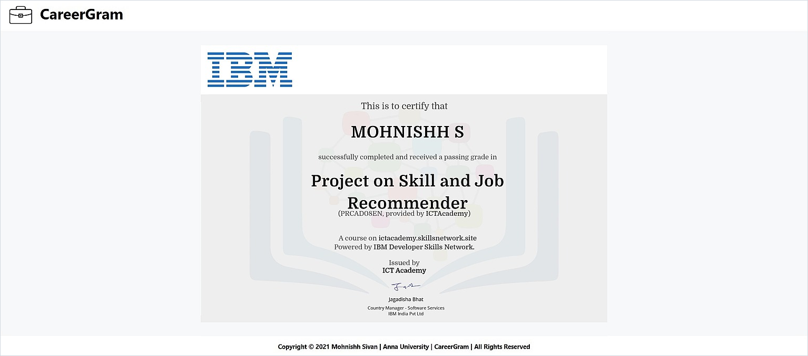

<h2>CareerGram - Skill And Job Recommendation Application</h2>

<h3>Preview -</h3>

<h3>Abstract -</h3>
▪ &nbsp;Developed a Deep Learning based Skill And Job Recommendation Application called CareerGram using HyperText Markup Language, Cascading Style Sheets, React JavaScript, Python Programming Language and Amazon Web Services. 

<h3>License -</h3>
▪ &nbsp;Registered under Anna University, College Of Engineering Guindy Campus License. The Copyright Notice and Permission Notice must be Attached in Each Version and Associated Files of this Software. 
▪ &nbsp;Copyright (C) 2021 Mohnishh Sivan. Anna University. CareerGram. All Rights Reserved. 
▪ &nbsp;Permission is Hereby Granted Without Charge to Only Members at Anna University, College Of Engineering Guindy Campus to Update the Version of this Software and Associated Files. Members are Prohibited from Official Software Agreements with No Permit to Duplicate, Merge, Distribute and SubLicense. The Software is Published in its Genuine State and Without Warranty. 
▪ &nbsp;Conclusively in Any Event the Original Copyright Holder is Not Responsible for Any Damage Caused by this Software. 